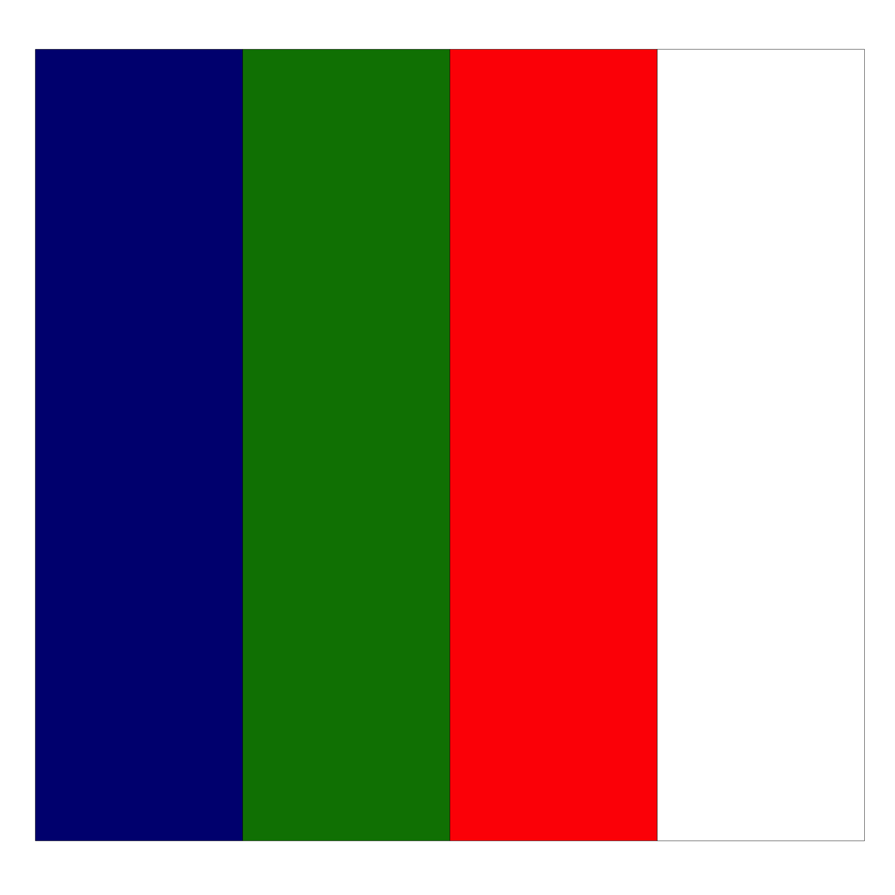
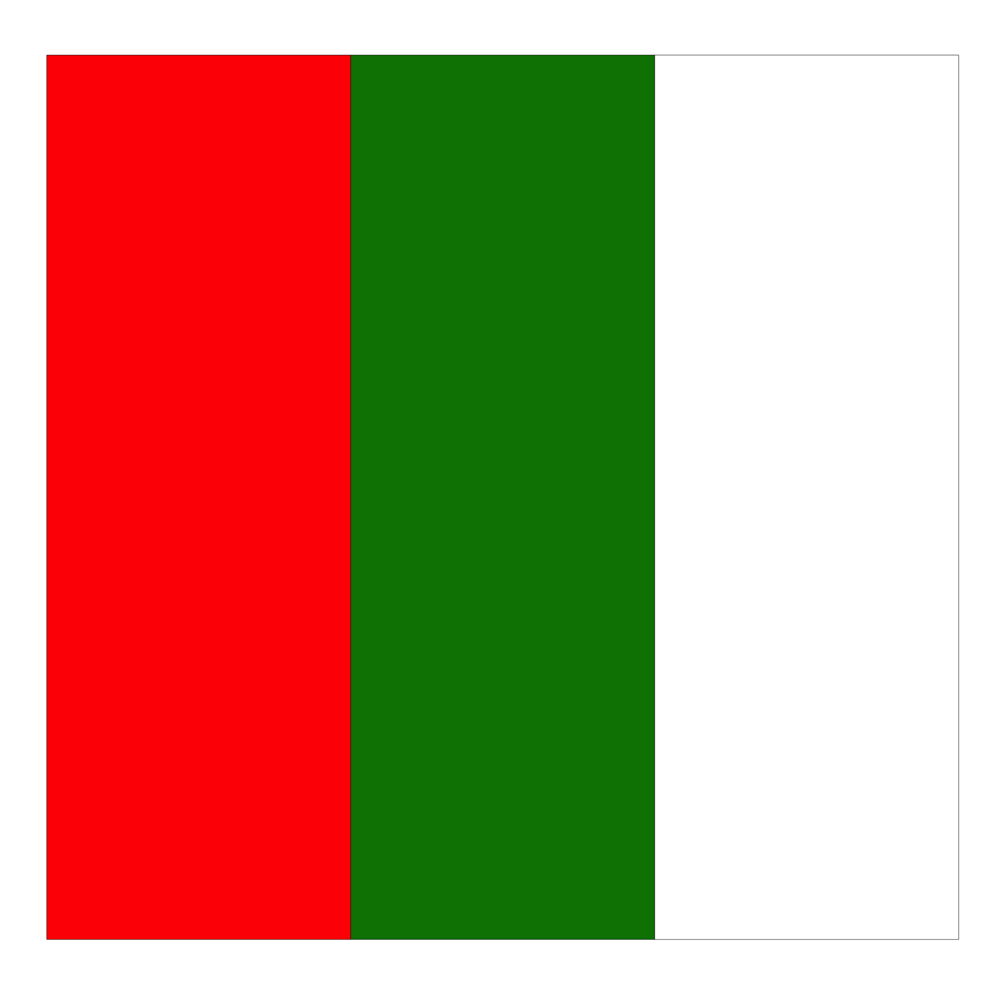

<!-- README.md is generated from README.Rmd. Please edit that file -->


# nrlTeamColours

<!-- badges: start -->
<!-- badges: end -->

The goal of nrlTeamColours is to extract NRL team colour palettes using the information obtained from each team's [wiki](https://en.wikipedia.org/wiki/National_Rugby_League).

## Installation

You can install the development version of nrlTeamColours from [GitHub](https://github.com/) with:

``` r
# install.packages("devtools")
devtools::install_github("alexwhitelockw/nrlTeamColours")
```

## Usage


```r
library(nrlTeamColours)

print(unique(nrl_team_colours$team_name))
#>  [1] "Brisbane Broncos"              "Canberra Raiders"             
#>  [3] "Canterbury-Bankstown Bulldogs" "Cronulla-Sutherland Sharks"   
#>  [5] "Gold Coast Titans"             "Manly Warringah Sea Eagles"   
#>  [7] "Melbourne Storm"               "Newcastle Knights"            
#>  [9] "New Zealand Warriors"          "North Queensland Cowboys"     
#> [11] "Parramatta Eels"               "Penrith Panthers"             
#> [13] "South Sydney Rabbitohs"        "St. George Illawarra Dragons" 
#> [15] "Sydney Roosters"               "Wests Tigers"                 
#> [17] "Dolphins (NRL)"
```

### Extracting NRL Team Colour Palette

The main function is extract a colour palette for a given team name. The number of colours to extract can also be specified (defaults to one colour).


```r
## Extracting the colour palette for Penrith Panthers
extract_team_palette(team_name="Penrith Panthers", n_colours=4)
#> [1] "#000000" "#FF0000" "#FFFF00" "#008000"
```

### Extracting NRL Match Day Colours

Colour palettes can also be extracted based on a given match. That is, colours for the home and away teams can be extracted using a single function.


```r
extract_matchday_palette(home_team="South Sydney Rabbitohs", away_team="Wests Tigers")
#> [1] "#FF0000" "#008000" "#FFFFFF" "#000000" "#FFFFFF" "#FC7E00"
```

### Visualising NRL Team Colour Palettes

#### Brisbane Broncos


```r
plot_team_palette("Brisbane Broncos")
```


```r
plot_team_palette("Canberra Raiders")
```


```r
plot_team_palette("Canterbury-Bankstown Bulldogs")
```


```r
plot_team_palette("Cronulla-Sutherland Sharks")
```


```r
plot_team_palette("Gold Coast Titans")
```


```r
plot_team_palette("Manly Warringah Sea Eagles")
```


```r
plot_team_palette("Melbourne Storm")
```


```r
plot_team_palette("Newcastle Knights")
```


```r
plot_team_palette("New Zealand Warriors")
```



```r
plot_team_palette("North Queensland Cowboys")
```


```r
plot_team_palette("Parramatta Eels")
```


```r
plot_team_palette("Penrith Panthers")
```


```r
plot_team_palette("South Sydney Rabbitohs")
```



```r
plot_team_palette("St. George Illawarra Dragons")
```


```r
plot_team_palette("Sydney Roosters")
```


```r
plot_team_palette("Wests Tigers")
```


```r
plot_team_palette("Dolphins (NRL)")
```


